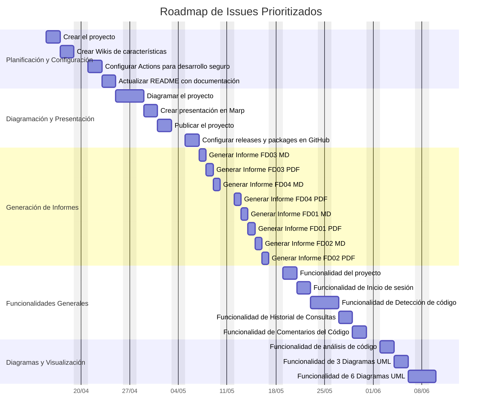
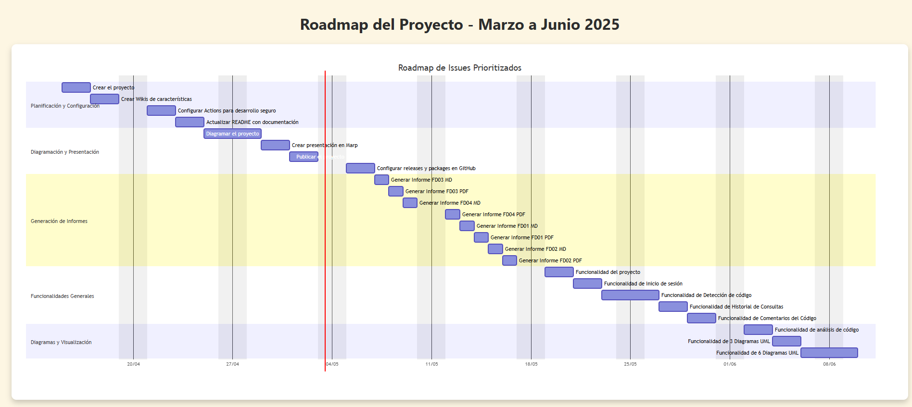

# 🗺️ Roadmap del Proyecto - Marzo a Junio 2025

```mermaid
gantt
  title Roadmap de Issues Prioritizados
  dateFormat  YYYY-MM-DD
  excludes    weekends
  axisFormat  %d/%m

  section Planificación y Configuración
  Crear el proyecto                          :a1, 2025-04-15, 2d
  Crear Wikis de características             :a2, after a1, 2d
  Configurar Actions para desarrollo seguro  :a3, after a2, 2d
  Actualizar README con documentación        :a4, after a3, 2d

  section Diagramación y Presentación
  Diagramar el proyecto                      :b1, after a4, 2d
  Crear presentación en Marp                 :b2, after b1, 2d
  Publicar el proyecto                       :b3, after b2, 2d
  Configurar releases y packages en GitHub   :b4, after b3, 2d

  section Generación de Informes
  Generar Informe FD03 MD                    :c1, after b4, 1d
  Generar Informe FD03 PDF                   :c2, after c1, 1d
  Generar Informe FD04 MD                    :c3, after c2, 1d
  Generar Informe FD04 PDF                   :c4, after c3, 1d
  Generar Informe FD01 MD                    :c5, after c4, 1d
  Generar Informe FD01 PDF                   :c6, after c5, 1d
  Generar Informe FD02 MD                    :c7, after c6, 1d
  Generar Informe FD02 PDF                   :c8, after c7, 1d

  section Funcionalidades Generales
  Funcionalidad del proyecto                 :d1, after c8, 2d
  Funcionalidad de Inicio de sesión          :d2, after d1, 2d
  Funcionalidad de Detección de código       :d3, after d2, 2d
  Funcionalidad de Historial de Consultas    :d4, after d3, 2d
  Funcionalidad de Comentarios del Código    :d5, after d4, 2d

  section Diagramas y Visualización
  Funcionalidad de análisis de código        :e1, after d5, 2d
  Funcionalidad de 3 Diagramas UML           :e2, after e1, 2d
  Funcionalidad de 6 Diagramas UML           :e3, after e2, 2d
```

